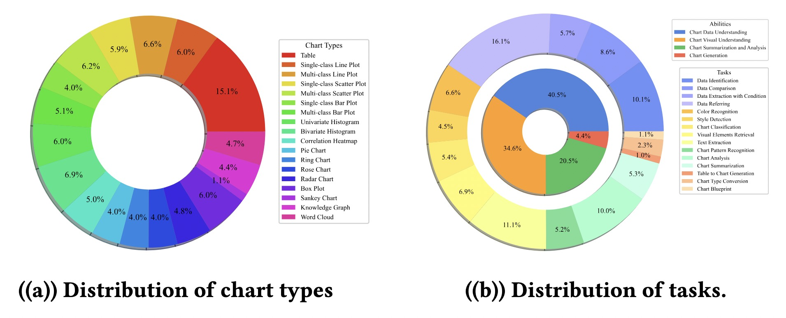
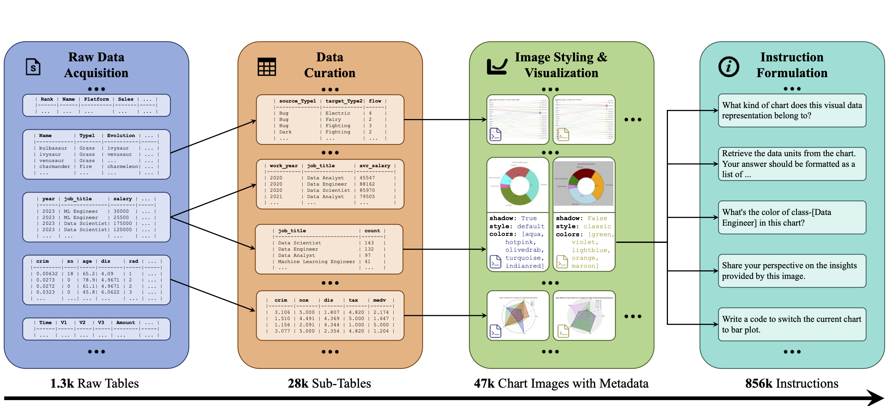
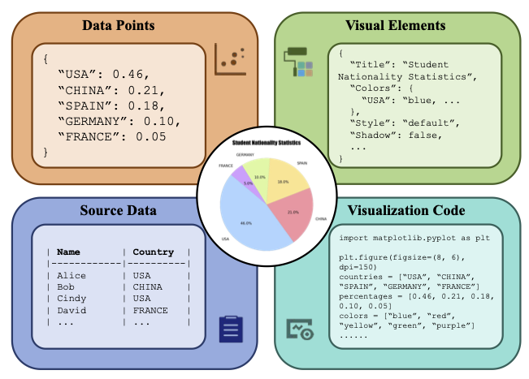
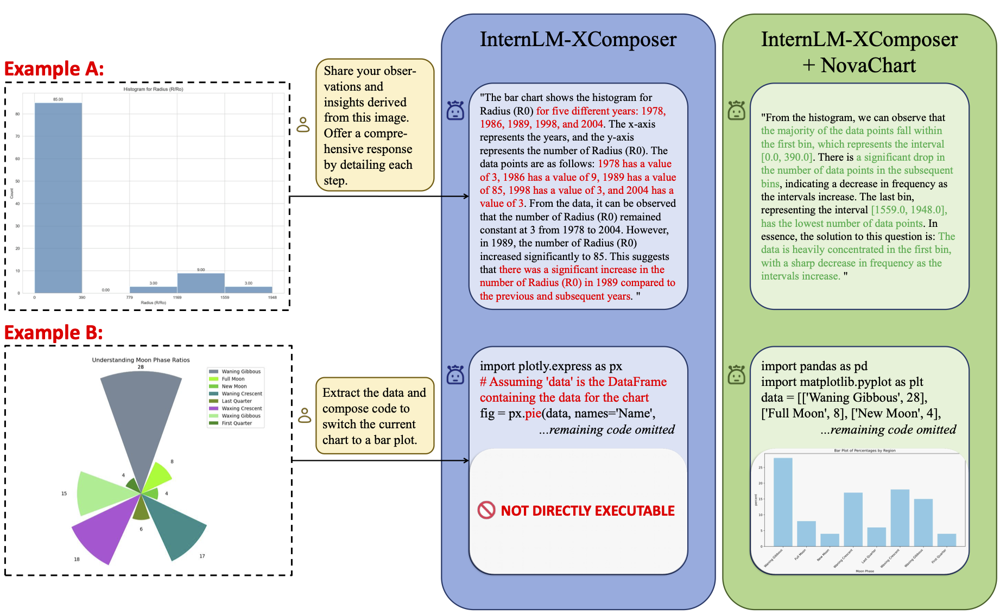

## NovaChart: A Large-scale Dataset towards Chart Understandingand Generation of Multimodal Large Language Models

<!-- ### 🔥🔥🔥 The LongerCrafter for longer high-quality video generation are now released! -->

<div align="center">
<!-- <p style="font-weight: bold">
✅ totally <span style="color: red; font-weight: bold">no</span> tuning &nbsp;&nbsp;&nbsp;&nbsp;
✅ less than <span style="color: red; font-weight: bold">20%</span> extra time &nbsp;&nbsp;&nbsp;&nbsp;
✅ support <span style="color: red; font-weight: bold">512</span> frames &nbsp;&nbsp;&nbsp;&nbsp;
</p> -->

 <a href='https://github.com/Elucidator-V/NovaChart/blob/main/paper/ACM_MM_NovaChart.pdf'></a> &nbsp;&nbsp;&nbsp;&nbsp;&nbsp;
 <a href='https://github.com/Elucidator-V/NovaChart/'></a> &nbsp;&nbsp;&nbsp;&nbsp;&nbsp;
 <a href='https://github.com/buaacyw/GaussianEditor/blob/master/LICENSE.txt'></a> &nbsp;&nbsp;&nbsp;&nbsp;&nbsp;
 <br><br>
<!--  [](https://huggingface.co/listen2you002/ChartLlama-13b) &nbsp;&nbsp;&nbsp;&nbsp;&nbsp; 
[](https://huggingface.co/datasets/listen2you002/ChartLlama-Dataset)
 -->


<!-- <p>Input: "A chihuahua in astronaut suit floating in space, cinematic lighting, glow effect"; 
<br>
Resolution: 1024 x 576; Frames: 64.</p> -->
<!-- 
<p>Input: "Campfire at night in a snowy forest with starry sky in the background"; 
<br>
Resolution: 1024 x 576; Frames: 64.</p> -->
</div>
 
## Data Overview
We create a large-scale chart dataset for chart understanding and generation of MLLMs, with extensive coverage of chart types, various chart-related tasks, and good scalability. We propose a fully-fledged data generation engine including Raw Data Acquisition, Data Curation, Image Styling and Visualization, and Instruction Formulation, supporting the construction of large-scale chart metadata and chart instruction data from scratch. We also release several tools which can be employed for NovaChart extension, to help the development of customized MLLMs with specific chart understanding and generation capabilities.
<br>
<p align="center">
    
<p>
<br>


### Data Engine
The framework of the data generation engine of NovaChart is illustrated in The following figure. It mainly comprises 4 steps. Detailed introduction can be found in our paper.
<br>
<p align="center">
    
<p>
<br>


### Chart Metadata
For every instance of chart, we provide 4 kinds of annotations: 1) data points which are statistical units of information represented by numerical values on the chart’s axes; 2) visual elements used in charts to convey information and enhance expressiveness, such as colors; 3) source data, the raw, unprocessed data samples from which the statistical chart is derived; 4) visualization code for chart images rendering with given data points and visual elements.


<br>
<p align="center">
    
<p>
<br>


### Chart Instruction Data
We design a comprehensive set of 15 unique tasks, covering 4 kinds of tasks: 

1) Chart Data Understanding, which aims to precisely understand the statistical data points within charts; 

2) Chart Visual Understanding,
which focuses on identifying particular visual elements in charts. 

3) Chart Summarization and Analysis, which aims to summarize and analyze the phenomena behind the data. 

4) Chart Generation, which focuses on generating executable visualization code (in Python) to help users create charts.


### NovaChart Toolkit

In addition to the data resources, we provide three tools for fellow researchers to facilitate utilization and
extension of NovaChart. 

Data curation tool enables users to reinitiate the process of obtaining chart metadata, enabling the generation of more chart instances of different topics. 

Chart visualization tool allows users to freely adjust relevant visualization parameters to generate chart images with more diversified visual styles. 

Instruction generation tool helps researchers leverage LLMs to create chart instruction data (based on chart metadata) covering a wider range of tasks, based on their own requirements. 


We aim to enable researchers to conveniently utilize NovaChart and assist them in generating high-quality chart data for their customized model training through these tools. We sincerely hope that our efforts can pave the way for the intelligent assistant with powerful capabilities in chart comprehension and generation.


### Model abilities
<br>
<p align="center">
    
<p>
<br>

### Using NovaChart

The full NovaChart dataset can be downloaded from the following link:


<!-- The dataset has the following structure: -->


<!-- Model evaluation Pipeline can be found in: -->


## 📖 TO-DO LIST
- [ ] Open source the evaluation scripts.
- [ ] Open source checkpoints.
- [x] Open source the dataset.
- [x] Create the git repository.


## 😉 Citation
```bib
@inproceedings{hu2024novachart,
  title={NovaChart: A Large-scale Dataset towards Chart Understanding and Generation of Multimodal Large Language Models},
  author={Hu, Linmei and Wang, Duokang and Pan, Yiming and Yu, Jifan and Shao, Yingxia and Feng, Chong and Nie, Liqiang},
  booktitle={ACM Multimedia 2024},
  year={2024}
}
```


****
